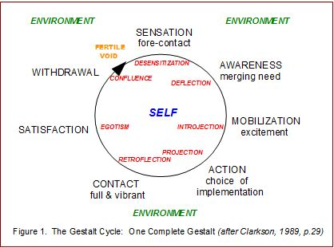

# Cycle of Experience

In Gestalt theory, stress and problems with human functioning happen when people get stuck in the various stages, unable to complete their cycle of experience.

This appears to also be called the needs satisfaction cycle.

1. *Sensation*: something figural happens that disturbs the individual from the steady state
    * Desensitization: a resistance between sensation and awareness that prevents the observer from being consciously aware of need
2. *Awareness*: awareness of a need for satisfaction
    * Deflection
3. Mobilization of energy:
    * Introjection
4. Action
    * Projection: projecting onto other people, freeing the individual from the responsibility to act
5. Contact
    * Retroflection
6. Satisfaction
    * Egotism
7. Withdrawal

TODO: clarify understanding on this

References:

* [Gestalt Cycle of Experience](http://www.clevelandconsultinggroup.com/articles/gestalt-cycle-of-experience.php)
