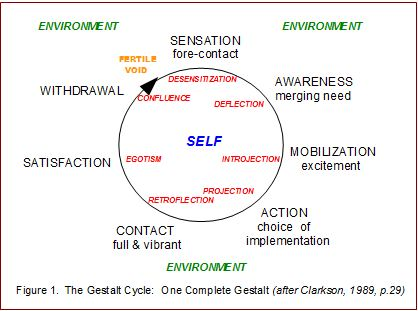

# Cycle of Experience

TLDR: taking care of unfinished business.

In Gestalt theory, stress and problems with human functioning happen when people get stuck in the various stages, unable to complete their cycle of experience.

A unit of work is a complete experience such as the completion of a task, resolution of a problem or a learning experience. When there is an incomplete unit of work, there is resistance somewhere along this cycle of experience that prevents the work from completing. Energy is released and available for other units of work only when the cycle of experience is complete.

This appears to be related to the needs satisfaction cycle, but it uses slightly different terminology.

1. *Sensation*: something figural happens that disturbs the individual from the steady state
    * Desensitization: a resistance between sensation and awareness that prevents the observer from being consciously aware of need
2. *Awareness*: awareness of a need for satisfaction
    * Deflection
3. Mobilization of energy:
    * Introjection
4. Action
    * Projection: projecting onto other people, freeing the individual from the responsibility to act
5. Contact
    * Retroflection
6. Satisfaction
    * Egotism
7. Withdrawal

## Resistances Are Not Always Negative

Resistances can also be interventions. To end sexual harassment, use introjection.

TODO: fill in the blanks

References:

* [Gestalt Cycle of Experience](http://www.clevelandconsultinggroup.com/articles/gestalt-cycle-of-experience.php)
